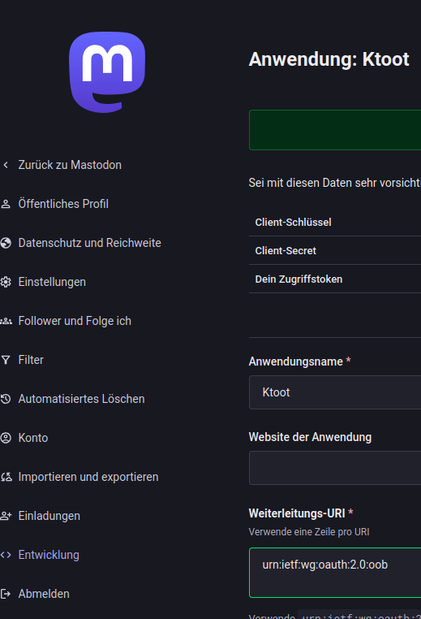

<div align="center">
  <h1>KToot</h1>
  <p><strong>Mastodon notification widget for KDE Plasma 6</strong></p>

  <a href="https://kde.org/">
    
  </a>
  <a href="https://www.gnu.org/licenses/gpl-3.0.html">
    
  </a>
  <a href="https://paypal.me/agundur">
    
  </a>
</div>

KToot puts your Mastodon notifications in the Plasma panel: an icon with an
unread badge, and a popup showing your latest mentions, follows, favourites
and boosts. Click to mark everything read, or let desktop notifications
(via KNotify) tell you as things happen.

## Features

| Feature | Details |
|---|---|
| Panel icon + unread badge | Click marks everything read |
| Full popup | Account handle, follower count, last 3 notifications |
| Desktop notifications | Per-notification for small backlogs, one summary popup for a large one |
| Per-type toggles | Show/hide mentions, follows, favourites, boosts individually |
| Pure QML/JS | No compiled plugin — KWallet access goes over D-Bus, not a C++ helper |
| i18n | `translate/` with `.po` files for de, en, es, fr |
| Tests | `tests/tst_mastodon.qml` (pure logic) + `tests/tst_plasmoid.qml`, run with `ctest` |

## Creating a Mastodon access token

KToot needs a personal access token for your account — not your password.
Create one on your own instance:

1. Go to **Settings → Development** (`https://<your-instance>/settings/applications`) and click **New application**.
2. Give it a name (e.g. "KToot"). Leave **Redirect URI** at its default (`urn:ietf:wg:oauth:2.0:oob`) — KToot doesn't use an OAuth redirect flow.
3. Under **Scopes**, `read` and `write` are enough (`read` covers accounts/notifications, `write` is needed so KToot can mark notifications as read via the markers API).
4. Save. Your instance shows the application's credentials immediately — copy **Your access token** (not the client key/secret):

   

5. In KToot's settings, enter your instance URL (must be `https://…`) and paste the token into **Access token**, then click **Verbindung testen & speichern** ("Test connection & save"). The token is stored in KWallet, keyed by instance URL — never in the plasmoid's config file.
6. Open the widget popup and click **Connect** — the popup shows "Getrennt" (disconnected) until you do, even with a saved token.

## Requirements

**Runtime** (using the plasmoid): KDE Plasma ≥ 6.2 (for the `org.kde.plasma.workspace.dbus` QML module KToot uses to talk to KWallet) and a running `kwalletd6`.

**Building** (only needed for a full system install, e.g. RPM packaging — see [Install](#install) below):

- Qt ≥ 6.7
- KDE Frameworks ≥ 6.10
- CMake ≥ 3.16
- Extra CMake Modules (ECM)

On openSUSE Tumbleweed:
```bash
sudo zypper install cmake extra-cmake-modules kf6-ki18n-devel kf6-kconfigwidgets-devel \
     kf6-kcmutils-devel kf6-notifications-devel kf6-iconthemes-devel \
     qt6-quick-devel qt6-test-devel qt6-quicktest-devel
```

On Arch / KDE neon / Ubuntu with KDE PPA — install the equivalent `*-dev`/`-devel` packages.

## Install

Pre-built packages are on the [releases page](https://github.com/Agundur-KDE/KToot/releases/latest): `.plasmoid` (plain KPackage archive, install via `kpackagetool6 -i`), `.rpm` (openSUSE, also available via the [OBS repo](https://download.opensuse.org/repositories/home:/Agundur/openSUSE_Tumbleweed/)), and `.deb` (Debian 13 "Trixie" / `sudo apt install ./ktoot_*.deb`).

To build from source, KToot is pure QML/JS — no compiled plugin — so a plain `kpackagetool6` install is enough for everyday use, no root and no build step required:

```bash
git clone https://github.com/Agundur-KDE/KToot.git
cd KToot
kpackagetool6 --type Plasma/Applet --install package/
# to update after a git pull:
kpackagetool6 --type Plasma/Applet --upgrade package/
```

Then add it via *Add Widgets* on your panel/desktop, or test in an isolated window with `plasmoidviewer -a de.agundur.ktoot`.

Note: `kpackagetool6` only installs into `~/.local/share/plasma/plasmoids/` — the app icon and the `ktoot.notifyrc` (desktop notification config) aren't registered system-wide that way. A full system install (icons in the hicolor theme, KNotify registration, distro packaging) goes through the CMake build instead.

## Test

```bash
mkdir build && cd build
cmake .. -DCMAKE_BUILD_TYPE=Debug
make tst_plasmoid
ctest --output-on-failure
```

`tst_mastodon.qml` covers the pure logic in `mastodon.js` (ID comparison, content-warning handling, instance URL validation, error classification, …); `tst_plasmoid.qml` is the QtQuickTest entry point.

## Contributing

Fork and adapt freely. If you improve something others would benefit from, a pull request is welcome.
